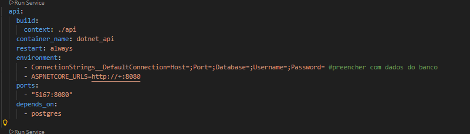
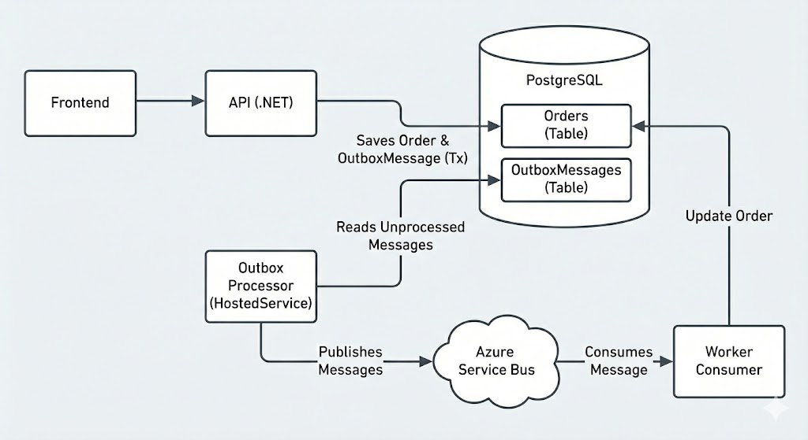

# 📘 Mini Documentação Técnica — Sistema de Pedidos

## 🧩 Visão Geral

Sistema de gestão de pedidos com processamento assíncrono utilizando **Outbox Pattern** para garantir consistência transacional e confiabilidade na mensageria.

## 🎯 Objetivo do Desafio

Desenvolver um sistema onde é possível:

- Criar pedidos
- Listar pedidos
- Visualizar detalhes

Sempre que um pedido for criado:

1. Ele é persistido no PostgreSQL.
2. Um evento é salvo na tabela Outbox.
3. Um processor publica o evento no Azure Service Bus.
4. Um worker consome a mensagem.
5. O status do pedido é atualizado seguindo a sequência:


## ⚙️ Pre-requisitos do Projeto

- .NET 8 
- Docker
- Postgres 16+
- [Criar tópico no Azure Service Bus com o nome **order-events** e uma subscription com o nome **notification** (ative a detecção de duplicidade no momento da criação do tópico)](https://learn.microsoft.com/pt-br/azure/service-bus-messaging/service-bus-quickstart-topics-subscriptions-portal).
 
Backend .env:
```js

{
  "ConnectionStrings": {
    "DefaultConnection": "Host=localhost;Port=;Database=;Username=;Password=",
    "AzureServiceBusConnection": "Endpoint=",
    "OpenIAApiKey": ""
  },
  "Logging": {
    "LogLevel": {
      "Default": "Information",
      "Microsoft.AspNetCore": "Warning"
    }
  },
  "AllowedHosts": "*"
}

```

No docker-compose.yml alterar os dados de acesso do DB :



Na pasta raiz do projeto, execute:
```js
  docker compose up --build
```

Após o build, pode descartar os parâmetros extras: 
```js
  docker compose up
```

Acesse o sistema em: 
```js
  http://localhost:3000/
```

Parar o container: 
```js
  docker compose down
```



## 🚀 Tecnologias Utilizadas

## Backend
- .NET 8
- Entity Framework Core
- PostgreSQL
- Azure Service Bus

## Frontend
- React
- Vite
- TailwindCSS
- React Router

## Infraestrutura
- Docker
- Docker Compose
- PostgreSQL


## ⚠️ Considerações

- Para simplificar o desenvolvimento, optei por criar o Worker consumer (OrderProcessor em background) na mesma aplicação do publisher (ServicePublisher).


## 📈 Melhorias se houvesse mais tempo

- Finalizar o Chatbot.
- Desacoplar totalmente o Order do publisher do Service Bus.
- Refinar idempotencia do Consumer.
- Inclusão de testes.